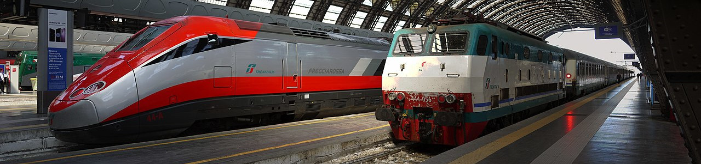

<sub><sub>Photo by Cristopher Down released under a Creative Commons License Attribution 4.0 International (CC BY 4.0)</sub></sub>

# Train Conflict Resolution Instances

These are instances for a Conflict Resloution (CR) algorithm, derived from the 2012 RAS Competition data.

## Citation

If you use these instances, please cite the following paper:

```bib
@article{bettinelli2017realtime,
  title={A real-time conflict solution algorithm for the {Train Rescheduling Problem}},
  author={Bettinelli, Andrea and Santini, Alberto and Vigo, Daniele},
  journal={{Transportation Research Part B: Methodological}},
  pages={237--265},
  volume=106,
  year=2017,
  doi={10.1016/j.trb.2017.10.005}
}
```

You can also cite this repository via Zenodo.

[](https://zenodo.org/badge/latestdoi/83153574)

```bib
@misc{ras_derived_github,
    title={Instances for a Conflict Resloution algorithm},
    author={Santini, Alberto},
    date={2017-02-25},
    howpublished={Github repository},
    doi={10.5281/zenodo.322571},
    url={https://github.com/alberto-santini/cr-ras-derived-instances/}
}
```

## Files description

* The files `network-macro` and `network-micro`, respectively, provide a macro- or microscopic description of the underlying network.
* Each instance consists of two files, in the form `forecast-timetable-X` and `nominal-timetable-X`. The latter contains the ideal published timetable of the trains; the former contains the current state of the network and, due to disturbances and disruptions, contains conflicts.
* The files `params-*` contain parameters common to multiple instances (rever to the above paper for more details).
* The file `restrictions-ras.xml` is unused for these instances.